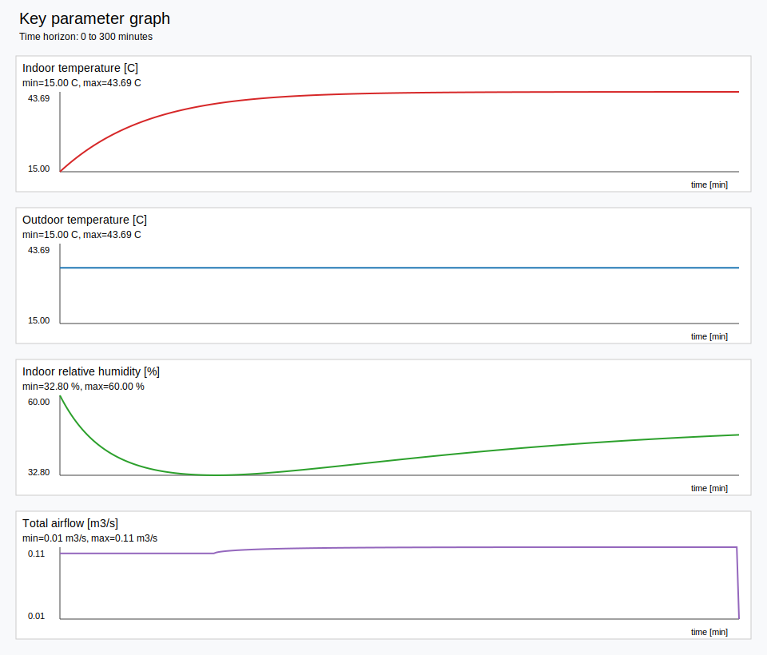

# cattle_climate_cpp

## Summary

`cattle_climate_cpp` is a lightweight C++ single-zone simulator for indoor dairy-barn or cultivation-room climate estimation. The package keeps a compact executable and library structure, reads predefined configuration from JSON, accepts actuator commands at runtime, and estimates the evolution of indoor temperature, humidity, and airflow while also reporting the outdoor climate conditions used to drive the simulation.

The current implementation is intentionally lightweight. It is **not** a full reproduction of IDA ICE or the complete Task 22 model library. Instead, it uses a simplified, engineering-style single-zone balance while preserving the official formula origins, names, and reference numbers in the code comments and formula helper layer.

## Introduction

The package was built to support repeated test scenarios such as:

- heater-only operation during cold weather
- fan-only operation during hot weather
- damper/fan/heater combinations at specified activity levels
- fixed-horizon simulations such as 300 seconds or 300 minutes
- SVG graph generation for key parameters over a specified time horizon

The simulator uses:

- a JSON settings file for building, opening, wall, climate, and actuator data
- a reusable C++ library API for step-based estimation
- a command-line executable for scenario testing
- CSV output for every simulation step
- optional SVG graph generation for key parameters

The package follows the modeling logic described in:

1. **Bring, Sahlin, Vuolle (1999), _Models for Building Indoor Climate and Energy Simulation_**
2. **Nguyen-Ky & Penttilä (2021), _Indoor Climate and Energy Model Calibration with Monitored Data of a Naturally Ventilated Dairy Barn in a Cold Climate_**

The official references motivate a model structure in which:

- outdoor climate is preprocessed into simulation-ready quantities
- wind and geometry influence pressure and airflow
- openings, leaks, and terminals influence ventilation
- indoor energy and humidity evolve from coupled balances
- local heating units provide controlled thermal input

## Main Challenges

### 1. Staying close to the official formalism while remaining lightweight
The source references are broad building-simulation formalisms with many submodels. A practical challenge is to preserve the formula origins and variable meanings while implementing a compact and reusable single-zone estimator.

### 2. Avoiding double counting of heat losses
A major issue in earlier generated versions was that exterior surface-balance terms were added on top of a lumped `UA * ΔT` envelope loss. This caused unrealistic over-cooling and prevented heater-driven warming.

### 3. Making actuator scenarios easy to test from the executable
The simulator must be runnable directly from the CLI by setting actuator switch states, activity percentages, active durations, and selected outdoor conditions.

### 4. Including outdoor climate as both input and output
Outdoor wind, humidity, temperature, radiation, and gas values need to be present in the configuration, applied in the computation, and written back into the results and CSV traces.

### 5. Accounting for actuator power and resource consumption
The simulator should not only estimate climate response but also track actuator power draw and resource usage over time.

## Approaches Used to Solve These Challenges

### A. Lightweight single-zone architecture
The simulator keeps a well-mixed, single-zone update loop. This preserves a simple structural logic and fast execution for repeated scenario testing.

### B. One primary envelope-loss path
The executable energy balance uses a **single lumped envelope-loss term** instead of combining it with an additional full-zone exterior wall loss. This corrects the earlier over-cooling behavior.

### C. Heater modeled as a local unit
The heater is treated as a local heating unit consistent with the official local-unit formalism:

- thermal heater output follows **formula (83)**
- heater electricity follows **formula (84)**

### D. Runtime actuator-command interface
The executable allows direct scenario control using options such as:

- `--dampers on|off`
- `--fans on|off`
- `--heaters on|off`
- `--damper-activity <0..100>`
- `--fan-driver <0..100>` or `--fan-driver-percent <0..100>`
- `--heater-activity <0..100>`
- `--duration-seconds`, `--duration-minutes`
- per-actuator active durations in seconds or minutes

### E. JSON-based predefined settings
The file `config/settings.json` stores:

- room geometry
- wall/roof/window thermal settings
- opening and leak parameters
- outdoor climate values
- actuator power and resource consumption limits

### F. Traceable outputs
The simulator writes:

- step-by-step CSV traces
- final indoor and outdoor conditions
- final airflow and average airflow
- actuator power and resource use
- optional SVG graphs for key variables

## Mechanical Formalisms Used

Below is the list of formula groups retained in the codebase and documented in the formula helper layer and source comments. The current executable uses a **subset directly** in the single-zone update loop, while the rest remain represented as traceable formalism functions for consistency with the earlier requested reference set.

### Climate preprocessing and psychrometrics

- **(1)** Sky temperature
- **(2)** Saturation pressure call
- **(3)** Vapour partial pressure
- **(4)** Humidity ratio from pressure and vapour pressure
- **(5)** Saturation pressure for sub-zero temperatures
- **(6)** Saturation pressure for above-zero temperatures
- **(7)** Humidity ratio function
- **(8)** Local wind speed from reference wind and building height
- **(9)** Solar time
- **(10)** Equation of time
- **(11)** Alternate equation-of-time form
- **(12)** Solar elevation
- **(13)** Solar declination
- **(14)** Solar azimuth

### Solar radiation, façade climate, and wind pressure

- **(23)** Incident angle on a surface
- **(24)** Direct radiation on a sloping surface
- **(25)** Direct radiation on a horizontal surface
- **(26)** ASHRAE diffuse radiation on a surface
- **(27)** Ground-reflected diffuse radiation
- **(28)** Kondratjev diffuse-radiation model
- **(29)** Perez tilted-surface irradiation
- **(30)** Perez coefficients
- **(31)** Brightness index
- **(32)** Air mass
- **(33)** Clearness parameter
- **(34)** Leeward local wind speed
- **(35)** External convective heat-transfer coefficient
- **(36)** Ground-level pressure

### Exterior wall-surface balance

- **(37)** Exterior convective heat transfer
- **(38)** Absorbed solar radiation on the exterior surface
- **(39)** Long-wave exchange with sky and ground
- **(40)** Total exterior wall heat balance

> Note: these functions are preserved in the formalism layer and comments, but the current executable does **not** add them as a second full-zone loss term on top of the lumped envelope loss.

### Windows and transmitted solar gain

- **(41)** Shading multiplier for total heat load
- **(42)** Shading multiplier for direct short-wave transmission
- **(43)** Reference transmitted solar gain through glazing
- **(44)** Short-wave radiation passing through a window
- **(45)** Indirect load reaching the zone through window absorption
- **(46)** Radiation absorbed in the window
- **(47)** U-value multiplier due to shading

### Internal sources and local units

- **(77)** Convective heat from occupants
- **(78)** Clothing-to-air convective coefficient
- **(79)** Clothing-area factor
- **(80)** Radiative heat from occupants
- **(81)** Moisture load
- **(82)** CO₂ load
- **(83)** Local unit thermal power
- **(84)** Local unit electric power via COP

> In this package, the heater is implemented through the local-unit path given by **(83)** and **(84)**.

### Zone radiation and simplified-zone relations

- **(85)** Irradiation from radiosities
- **(86)** Long-wave radiosity
- **(87)** Short-wave radiosity
- **(88)** Net long-wave absorbed radiation
- **(89)** Net short-wave absorbed radiation
- **(90)** Long-wave radiation from internal sources
- **(91)** Floor-level air heat balance under displacement ventilation
- **(92)** Simplified-zone mean-radiant exchange relation

### Air terminals

- **(93)** Controlled terminal mass flow
- **(94)** Linearized natural-ventilation terminal flow
- **(95)** Off-state low flow
- **(96)** Heat transport in a terminal
- **(97)** Contaminant transport in a terminal
- **(98)** Moisture transport in a terminal

### Leaks

- **(99)** Leak flow for positive pressure difference
- **(100)** Leak flow for negative pressure difference
- **(101)** Linearized leak flow near zero pressure difference
- **(102)** Pressure difference across a leak
- **(103)** Heat transport through a leak
- **(104)** Contaminant transport through a leak
- **(105)** Moisture transport through a leak
- **(106)** Thermal bridge term

### Large vertical openings

- **(107)** Pressure difference at the bottom of opening
- **(108)** Pressure difference at the top of opening
- **(109)** Flat-profile mass flow, one direction
- **(110)** Flat-profile mass flow, opposite direction
- **(111)** Neutral level
- **(112)** Helper variable Top
- **(113)** Helper variable Bot
- **(114)** Slanted-profile mass-flow case 1
- **(115)** Slanted-profile mass-flow case 2
- **(116)** Slanted-profile mass-flow case 3
- **(117)** Slanted-profile mass-flow case 4
- **(118)** Slanted-profile mass-flow case 5
- **(119)** Slanted-profile mass-flow case 6
- **(120)** Net mass flow through the opening
- **(121)** Net heat flow through the opening
- **(122)** Net contaminant flow through the opening
- **(123)** Net moisture flow through the opening

### RC wall note

The reference also uses the **RCWALL** model for wall and insulation dynamics. In the original report, this appears as a model block with parameters such as layer thickness, conductivity, density, specific heat, and area. It is important conceptually, but it is not presented there as a single numbered closed-form equation in the same way as the formula numbers listed above.

## Which Formalisms Drive the Current Executable Most Directly

The current single-zone executable uses the following formula groups most directly:

- **(1)–(8)** for outdoor temperature, humidity, and wind preprocessing
- **(24)–(27)** and **(41)–(47)** for solar and window gain estimation
- **(36)** for wind-pressure style influence on airflow
- **(83)** and **(84)** for heater thermal/electric behavior
- leak/opening/terminal-inspired flow logic based on **(93)–(123)**
- simplified indoor heat and humidity update logic consistent with the energy and moisture balance philosophy described in the dairy-barn paper

## Configuration File

The predefined settings file is:

- `config/settings.json`

It includes values for:

- room length, width, and height
- wall, roof, and window thermal parameters
- opening and ventilation coefficients
- outdoor temperature, humidity, CO₂, wind speed, wind direction, direct radiation, and diffuse radiation
- maximum fan flow and fan electrical power
- damper electrical power and resource use
- heater maximum thermal power, heater COP, heater electrical power, and resource use

## Library API

Main methods:

- `SimulationSettings load_settings_from_json(const std::string& path)`
- `SingleZoneSimulator simulator(settings)`
- `SimulationResult result = simulator.estimate(command)`

Typical workflow:

1. Load settings from JSON.
2. Build a `SingleZoneSimulator`.
3. Define actuator command states and active durations.
4. Run `estimate(...)`.
5. Inspect the result object or write CSV/graph output.

## Build

```bash
mkdir -p build
cd build
cmake ..
cmake --build . -j
```

## Executable Usage

Show CLI help:

```bash
./cattle_climate_example --help
```

### Example 1: Heater-only, cold outdoor condition, 300 minutes

```bash
./cattle_climate_example \
  --settings ../config/settings.json \
  --duration-minutes 300 \
  --outside-temp-c -10 \
  --dampers off \
  --fans off \
  --heaters on \
  --heater-activity 100 \
  --heaters-active-minutes 300 \
  --csv heater_only_300m.csv
```

### Example 2: Fan-only, hot outdoor condition, 42% fan driver, 300 seconds

```bash
./cattle_climate_example \
  --settings ../config/settings.json \
  --duration-seconds 300 \
  --outside-temp-c 35 \
  --dampers off \
  --fans on \
  --fan-driver 42 \
  --fans-active-seconds 300 \
  --heaters off \
  --csv fan_only_hot_300s.csv
```

### Example 3: Fan-only, 300 minutes, graph output enabled

```bash
./cattle_climate_example \
  --settings ../config/settings.json \
  --duration-minutes 300 \
  --outside-temp-c 35 \
  --dampers off \
  --fans on \
  --fan-driver 42 \
  --fans-active-minutes 300 \
  --heaters off \
  --csv fan_only_hot_300m.csv \
  --graph vital_params_0_300m.svg \
  --graph-max-minutes 300
```

## Outputs

The simulator can produce:

- final outside temperature
- final outside relative humidity
- final outside CO₂
- final outside reference wind speed
- final outside wind direction
- final local wind speed at building height
- final inside temperature
- final inside relative humidity
- final airflow
- average airflow over time
- heater thermal gain trace
- envelope loss trace
- ventilation loss trace
- actuator electrical power traces
- cumulative actuator electrical energy
- cumulative actuator resource use
- optional SVG graph of key parameters

## Results and Behavior Notes

The current package is intended for **engineering scenario testing**, not formal certification-grade prediction.

Observed qualitative results from the updated simulator versions include:

- after removal of the double-counted wall-loss path, heater-only cold scenarios can now increase indoor temperature as expected when heater capacity is sufficient
- fan-only hot scenarios visibly change the airflow trace and affect the indoor climate trend
- CSV outputs now expose both indoor and outdoor drivers, making runs easier to interpret and debug
- actuator power/resource accounting allows rough operational comparisons between scenarios

Important caution:

- the default heater power in the formalism-corrected configuration was intentionally set high enough to make the heating effect visible; users should retune it for realistic barn or room conditions
- the model is well mixed and does not resolve detailed stratification or local obstacles such as individual cows as airflow obstructions
- the code preserves many formula functions from the official references even when the executable uses only a simplified subset directly
vital_params_0_300m with dampers off duration-minutes 300 outside-temp-c 35 fan-driver 42% 


## Limitations

- single-zone, well-mixed indoor air assumption
- no explicit cow heat, moisture, or CO₂ source term by default
- no CFD, no detailed 3D flow field, and no explicit cow-body obstacle geometry
- no full RCWALL dynamic conduction solution in the executable loop
- no full IDA ICE controller stack, although the local-unit formalism is retained

## File Overview

- `src/main.cpp` — executable scenario runner and CLI
- `src/settings.cpp` — JSON settings loader
- `src/formulas.cpp` — documented formalism helper functions
- `src/simulator.cpp` — single-zone simulation engine
- `config/settings.json` — predefined simulation settings
- `CMakeLists.txt` — build definition

## References

1. Bring, A., Sahlin, P., & Vuolle, M. (1999). **Models for Building Indoor Climate and Energy Simulation**. Swedish Council for Building Research / Task 22 building energy simulation framework. This is the main source of the formula numbering used in the code comments and formalism layer.
2. Nguyen-Ky, T., & Penttilä, J. (2021). **Indoor Climate and Energy Model Calibration with Monitored Data of a Naturally Ventilated Dairy Barn in a Cold Climate**. This is the main source for the dairy-barn application context and the simplified-zone, naturally ventilated barn interpretation.

## License / Usage Note

This package was prepared as a lightweight engineering and research prototype for scenario testing. Users should validate and recalibrate it before applying it to real design or operational decisions.
